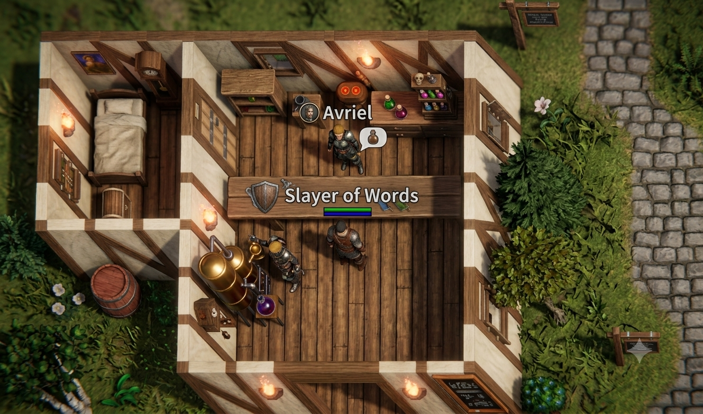
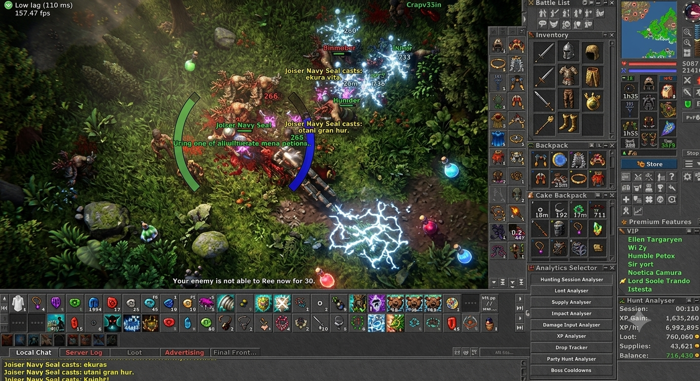

# Azonera RPG

**Realistyczne, izometryczne dark‑fantasy MMORPG** — własny świat, własna oprawa i lore Azonery,
z głębią systemów klasycznego MMORPG (leveling, skille, profesje, walka, loot, ekwipunek, questy, ekonomia).

> Silnik: **Unity 6000.6.0f1** (URP, Linear) · Język: **C#** · Platforma: **PC‑first** (Android w planie) ·
> Repo: **prywatne**. Pełny onboarding: [`docs/AZONERA_HANDOVER.md`](docs/AZONERA_HANDOVER.md).

---

## 🎯 Wizja
Azonera = **własna gra** (świat, grafika, assety, lore) + **feeling klasycznego MMORPG** (progresja, walka, eksploracja,
NPC, handel, dungeony, PvP). Nie kopia — własna tożsamość przy zachowaniu głębi i satysfakcji z rozwoju postaci.

## 🖼️ Kierunek wizualny (referencje)
Cel: realistyczne izometryczne 3D + gęsty, „klasyczny" HUD. Analiza: [`docs/AZONERA_VISUAL_REFERENCE.md`](docs/AZONERA_VISUAL_REFERENCE.md).




## ✅ Stan (co działa)
- **Pętla single‑player** (walka → śmierć → EXP → loot → pickup, staty/inventory/equipment/save) — zweryfikowana testami
  (**EditMode 22/22, PlayMode 1/1**).
- **Faza 1 — Player/Progresja/Skille:** krzywa EXP, system skilli z treningiem/awansem (wpływa na obrażenia),
  profesje data‑driven (Knight/Sorcerer/Druid/Paladin/Mage/Monk).
- **Classic HUD:** portret, HP/Mana, panel Skills, doll ekwipunku, backpack, minimapa, battle list, chat, hotbary.
- **Postać gracza:** artykułowany rycerz (rig ze stawami) z warstwowym pancerzem i proceduralną animacją chodu/idle.
- **Świat:** scena `AzoneraTemple` (ciemny loch + pochodnie + ołtarz), kamera izometryczna, potwory i NPC do testów.

> Grafika środowiska to na razie **GREYBOX** (bryły + PBR), jawnie oznaczony jako DEBUG — architektura gotowa pod
> podmianę na docelowe modele/render (patrz [`docs/AZONERA_ART_BIBLE.md`](docs/AZONERA_ART_BIBLE.md)).

## 🚀 Szybki start
```bash
git clone https://github.com/azonerapl/AzoneraRPG.git   # repo prywatne — wymaga dostępu collaborator
```
1. **Unity Hub → Add** → wskaż folder projektu (Unity **6000.6.0f1**). Pierwsze otwarcie odbuduje `Library/` (kilka minut).
2. Otwórz scenę **`Assets/Azonera/Scenes/AzoneraTemple.unity`** → **Play**.
3. **Sterowanie:** `WSAD` ruch · `kółko` zoom · `Q/E` obrót kamery · `LPM` atak/rozmowa · `F1` panel dev · `F5/F9` zapis/wczyt.

## 🧱 Budowanie scen (menu „Azonera" w edytorze)
- **★ Zbuduj Loch Referencyjny (Temple + Classic HUD)** — regeneruje `AzoneraTemple`.
- **★ Zbuduj Vertical Slice (wszystko)** — wioska `AzoneraStartingVillage`.
- **1. Utwórz dane gry** — generuje ScriptableObjects (klasy/itemy/potwory/loot).

Sceny są **generowane z kodu** (idempotentnie). Batchmode i pełne komendy: [`docs/AZONERA_HANDOVER.md`](docs/AZONERA_HANDOVER.md).

## 🧪 Testy
- **GUI:** `Window → General → Test Runner` → Run All.
- **CLI (edytor zamknięty):** [`docs/TESTING.md`](docs/TESTING.md).

## 🗂️ Struktura
```
Assets/Azonera/
  Scripts/   kod runtime (asmdef Azonera.Runtime): Core, Stats, Classes, Progression, Skills,
             Combat, Monsters, NPC, Items, Inventory, Equipment, Loot, Camera, Player, UI, Save, VFX, Debug
  Editor/    generatory scen/danych (asmdef Azonera.Editor)
  Tests/     EditMode + PlayMode (asmdef Azonera.Tests.*)
  ScriptableObjects/ + Resources/  dane gry
  Scenes/ Materials/ Art/          sceny, materiały, docelowe assety
docs/        dokumentacja projektu
```

## 📚 Dokumentacja
| Plik | Zawartość |
|---|---|
| [`docs/AZONERA_HANDOVER.md`](docs/AZONERA_HANDOVER.md) | Onboarding: setup, build, testy, konwencje, blokery |
| [`docs/AZONERA_DEV_JOURNAL.md`](docs/AZONERA_DEV_JOURNAL.md) | Dziennik rozwoju (od początku) |
| [`docs/AZONERA_CURRENT_STATE.md`](docs/AZONERA_CURRENT_STATE.md) | Stan systemów (WORKING/PARTIAL/…) |
| [`docs/AZONERA_ROADMAP.md`](docs/AZONERA_ROADMAP.md) | Plan produkcji (fazy) |
| [`docs/AZONERA_ART_BIBLE.md`](docs/AZONERA_ART_BIBLE.md) | Standard wizualny + szablon promptów assetów |
| [`docs/AZONERA_VISUAL_REFERENCE.md`](docs/AZONERA_VISUAL_REFERENCE.md) | Analiza referencji |
| [`docs/TESTING.md`](docs/TESTING.md) | Jak uruchamiać testy |

## 🗺️ Roadmapa (skrót)
Faza 1 (Player/Skille) ✔ → Faza 2 (Items Definition/Instance, DamageCalculator, TargetSystem+BattleList, spelle) →
NPC/Questy/Ekonomia → Świat/Dungeony/Minimapa → Party/Guild/PvP → Save/Sieć → Content → Polish.
Szczegóły: [`docs/AZONERA_ROADMAP.md`](docs/AZONERA_ROADMAP.md).

## 🤝 Współpraca
Zasady i workflow: [`CONTRIBUTING.md`](CONTRIBUTING.md).

## 📄 Licencja
Oprogramowanie własnościowe — patrz [`LICENSE`](LICENSE). Wszelkie prawa zastrzeżone.
